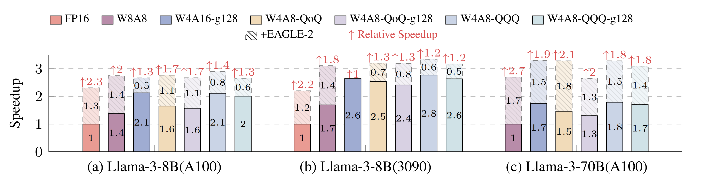

# Speculative Decoding Meets Quantization: Compatibility Evaluation and Hierarchical Framework Design

[](https://arxiv.org/abs/2505.22179) [](https://opensource.org/licenses/MIT)

## Introduction
We present a systematic evaluation of the compatibility between speculative decoding and quantization.

We also propose a hierarchical speculative decoding framework for W4A16 models, achieving a **1.31**$\times$ speedup over EAGLE-2.

And all experiments are implemented in C/CUDA.

## Speedup

<div align="center">
  
</div>

Speedup achieved by integrating Speculative Decoding and Quantization.

## Installation from source

```bash
conda create -n specmquant python=3.11 && conda activate specmquant
# install pytorch for your platform, see https://pytorch.org
git clone https://github.com/AI9Stars/SpecMQuant --recursive && cd SpecMQuant
vim setup.py # change arch="80" to other code for your platform, see https://developer.nvidia.com/cuda-gpus#compute
pip install .
```

## Evaluation

### Model Preparation

Downloads the quantized model weights and corresponding EAGLE model into the `models` folder.

<table>
  <thead>
    <tr>
      <th>Base Model</th>
      <th>Precision</th>
      <th>Quantized Model</th>
      <th>EAGLE Model</th>
    </tr>
  </thead>
  <tbody>
    <tr>
      <td rowspan="5"> <a href="https://huggingface.co/meta-llama/Meta-Llama-3-8B-Instruct" target="_blank">meta-llama/Meta-Llama-3-8B-Instruct</a></td>
      <td>W8A8</td>
      <td><a href="https://huggingface.co/YudiZh/Meta-Llama-3-8B-Instruct-W8A8" target="_blank">Meta-Llama-3-8B-Instruct-W8A8</a></td>
      <td><a href="https://huggingface.co/yuhuili/EAGLE-LLaMA3-Instruct-8B" target="_blank">yuhuili/EAGLE-LLaMA3-Instruct-8B</a></td>
    </tr>
    <tr>
      <td rowspan="2">W4A16</td>
      <td><a href="https://huggingface.co/YudiZh/Meta-Llama-3-8B-Instruct-W4A16-g128" target="_blank">Meta-Llama-3-8B-Instruct-W4A16-g128</a></td>
      <td><a href="https://huggingface.co/yuhuili/EAGLE-LLaMA3-Instruct-8B" target="_blank">yuhuili/EAGLE-LLaMA3-Instruct-8B</a></td>
    </tr>
    <tr>
      <td><a href="https://huggingface.co/YudiZh/Meta-Llama-3-8B-Instruct-W4A16-g128-Rot" target="_blank">Meta-Llama-3-8B-Instruct-W4A16-g128-Rot</a></td>
      <td><a href="https://huggingface.co/YudiZh/EAGLE-LLaMA3-Instruct-8B-on-W4A16-Rot" target="_blank">EAGLE-LLaMA3-Instruct-8B-on-W4A16-Rot</a></td>
    </tr>
    <tr>
      <td rowspan="2">W4A8</td>
      <td><a href="https://huggingface.co/YudiZh/Meta-Llama-3-8B-Instruct-W4A8-QQQ" target="_blank">Meta-Llama-3-8B-Instruct-W4A8-QQQ</a></td>
      <td><a href="https://huggingface.co/YudiZh/EAGLE-LLaMA3-Instruct-8B-on-W4A8-QQQ" target="_blank">EAGLE-LLaMA3-Instruct-8B-on-W4A8-QQQ</a></td>
    </tr>
    <tr>
      <td><a href="https://huggingface.co/YudiZh/Meta-Llama-3-8B-Instruct-W4A8-QQQ-g128" target="_blank">Meta-Llama-3-8B-Instruct-W4A8-QQQ-g128</a></td>
      <td><a href="https://huggingface.co/YudiZh/EAGLE-LLaMA3-Instruct-8B-on-W4A8-QQQ" target="_blank">EAGLE-LLaMA3-Instruct-8B-on-W4A8-QQQ</a></td>
    </tr>
    <tr>
      <td rowspan="5"> <a href="https://huggingface.co/meta-llama/Meta-Llama-3-70B" target="_blank">meta-llama/Meta-Llama-3-70B</a></td>
      <td>W8A8</td>
      <td><a href="https://huggingface.co/YudiZh/Meta-Llama-3-70B-Instruct-W8A8" target="_blank">Meta-Llama-3-70B-Instruct-W8A8</a></td>
      <td><a href="https://huggingface.co/yuhuili/EAGLE-LLaMA3-Instruct-70B" target="_blank">yuhuili/EAGLE-LLaMA3-Instruct-70B</a></td>
    </tr>
    <tr>
      <td rowspan="2">W4A16</td>
      <td><a href="https://huggingface.co/YudiZh/Meta-Llama-3-70B-Instruct-W4A16-g128" target="_blank">Meta-Llama-3-70B-Instruct-W4A16-g128</a></td>
      <td><a href="https://huggingface.co/yuhuili/EAGLE-LLaMA3-Instruct-70B" target="_blank">yuhuili/EAGLE-LLaMA3-Instruct-70B</a></td>
    </tr>
    <tr>
      <td><a href="https://huggingface.co/YudiZh/Meta-Llama-3-70B-Instruct-W4A16-g128-Rot" target="_blank">Meta-Llama-3-70B-Instruct-W4A16-g128-Rot</a></td>
      <td><a href="https://huggingface.co/YudiZh/EAGLE-LLaMA3-Instruct-70B-on-W4A16-Rot" target="_blank">EAGLE-LLaMA3-Instruct-70B-on-W4A16-Rot</a></td>
    </tr>
    <tr>
      <td rowspan="2">W4A8</td>
      <td><a href="https://huggingface.co/YudiZh/Meta-Llama-3-70B-Instruct-W4A8-QQQ" target="_blank">Meta-Llama-3-70B-Instruct-W4A8-QQQ</a></td>
      <td><a href="https://huggingface.co/YudiZh/EAGLE-LLaMA3-Instruct-70B-on-W4A8-QQQ" target="_blank">EAGLE-LLaMA3-Instruct-70B-on-W4A8-QQQ</a></td>
    </tr>
    <tr>
      <td><a href="https://huggingface.co/YudiZh/Meta-Llama-3-70B-Instruct-W4A8-QQQ-g128" target="_blank">Meta-Llama-3-70B-Instruct-W4A8-QQQ-g128</a></td>
      <td><a href="https://huggingface.co/YudiZh/EAGLE-LLaMA3-Instruct-70B-on-W4A8-QQQ" target="_blank">EAGLE-LLaMA3-Instruct-70B-on-W4A8-QQQ</a></td>
    </tr>
  
  </tbody>
</table>

----------

Or you can also choose one of the following external toolkits to quantize your model and then convert the resulting checkpoints.

#### 1. Supported Toolkits & Precision
<table>
  <thead>
    <tr>
      <th>Toolkit</th>
      <th>Precison</th>
      <th>Algorithm</th>
    </tr>
  </thead>
  <tr>
      <td><a href="https://github.com/AutoGPTQ/AutoGPTQ" target="_blank">AutoGPTQ</a></td>
      <td>W4A16</td>
      <td>GPTQ</td>
  </tr>
  <tr>
      <td><a href="https://github.com/HandH1998/QQQ" target="_blank">QQQ</a></td>
      <td>W4A8</td>
      <td>QQQ</td>
  </tr>
  <tr>
      <td rowspan="2"><a href="https://github.com/mit-han-lab/deepcompressor" target="_blank">DeepCompressor</a></td>
      <td>W8A8</td>
      <td>SmoothQuant</td>
  </tr>
  <tr>
      <td>W4A8</td>
      <td>QoQ</td>
  </tr>
  </tbody>
</table>

> For AutoGPTQ, our framework is only compatible when `sym=True` is set in the config, and if you set `desc_act=True` then you should also set `static_group=True`.

#### 2. Model Convert

For `W4A16`, `W4A8-QQQ`, `W4A8-QQQ-g128` and `W4A8-QoQ-g128`, after quantizing with the above toolkits you need to convert the model checkpoints using the scripts in `scripts/model_convert`. And for the models applied with rotation method, you need to convert the eagle checkpoint using the scripts `scripts/model_convert/convert_eagle_rotation.sh` with the corresponding rotation matrix.

---------

### Run Evaluation

#### MT-Bench

All scripts for `MT-Bench` evaluation are located in the `scripts/eval/mt_bench` folder. Here we use Llama-3-8B-Instruct as an example:

```bash
# 1. Run evaluations
bash scripts/eval/mt_bench/llama3-8b-instruct/<precision>/run_baseline.sh
bash scripts/eval/mt_bench/llama3-8b-instruct/<precision>/run_eagle.sh

# 2. Evaluate speed
bash scripts/mt_bench/llama3-8b-instruct/speed_up.sh

```

Replace `<precision>` with one of: `fp16`, `w4a16`, `w4a8-qqq`, `w4a8-qqq-g128`, `w4a8-qoq`, or `w4a8-qoq-g128`.

---------

#### Spec-Bench

Scripts for `Spec-Bench` evaluation in W4A16 Llama-3-70B-Instruct models are located in the `scripts/eval/spec_bench` folder.

```bash
# 1. Run evaluations
bash scripts/eval/spec_bench/llama3-70b-instruct-w4a16/run_baseline.sh
bash scripts/eval/spec_bench/llama3-70b-instruct-w4a16/run_spec.sh
bash scripts/eval/spec_bench/llama3-70b-instruct-w4a16/run_eagle.sh
bash scripts/eval/spec_bench/llama3-70b-instruct-w4a16/run_hierspec.sh


# 2. Evaluate speed
bash scripts/eval/spec_bench/llama3-70b-instruct-w4a16/speedup.sh

```

--------
#### Performance evaluation

We provide the performance evaluation for `gsm8k` and `human_eval`.

```bash
# 1. Run evaluations
bash scripts/eval/<benchmark>/llama3-8b-instruct/<precision>/run_baseline.sh

# 2. Evaluate preformance
bash scripts/eval/<benchmark>/llama3-8b-instruct/check_correctness.sh
```
Replace `<benchmark>` with one of: `gsm8k` or `human_eval`.

## Contributors
- [Yudi Zhang](https://github.com/YudiZh)
- [Weilin Zhao](https://github.com/Achazwl)

## Acknowledgment
Our framework is based on [https://github.com/thunlp/FR-Spec](https://github.com/thunlp/FR-Spec).

Our experiments are based on [https://github.com/SafeAILab/EAGLE](https://github.com/SafeAILab/EAGLE).

The CUDA quantization kernels in `src/qgemm` are borrowed from:
- W4A16 marlin kernel:[https://github.com/vllm-project/vllm](https://github.com/vllm-project/vllm) and [https://github.com/IST-DASLab/marlin](https://github.com/IST-DASLab/marlin).
- W4A8-QQQ kernel: [https://github.com/HandH1998/QQQ](https://github.com/HandH1998/QQQ).
- W8A8 and W4A8-QoQ: [https://github.com/mit-han-lab/omniserve](https://github.com/mit-han-lab/omniserve).

The `evaluation/` folder is modified base on [https://github.com/hemingkx/Spec-Bench](https://github.com/hemingkx/Spec-Bench):
- The `evaluation/gsm8k` folder integrates part of the code from [https://github.com/Guangxuan-Xiao/GSM8K-eval](https://github.com/Guangxuan-Xiao/GSM8K-eval).
- The `evaluation/humaneval` folder integrates part of the code from [https://github.com/evalplus/evalplus](https://github.com/evalplus/evalplus).

The `src/flash_attn/` folder is modified base on [https://github.com/Dao-AILab/flash-attention/blob/v2.4.2/csrc/flash_attn](https://github.com/Dao-AILab/flash-attention/blob/v2.4.2/csrc/flash_attn).

## Citation

```
@article{zhang2025specmqaunt,
  title={Speculative Decoding Meets Quantization: Compatibility Evaluation and Hierarchical Framework Design},
  author={Zhang, Yudi and Zhao, Weilin and Han, Xu and Zhao, Tiejun and Xu, Wang and Cao, Hailong and Zhu, Conghui},
  journal={arXiv preprint arXiv:2505.22179},
  year={2025}
}
```